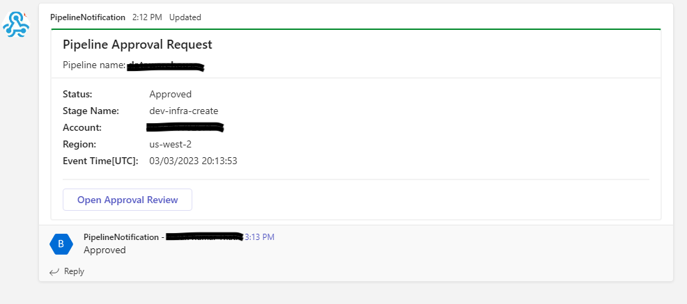

# Ms Teams Approve Pipeline Deployments

Execute Approvals of CodePipeline stages from MS Teams.

## Description

With increasing number of pipelines running in multiple accounts for different applications it becomes difficult to manage all approvals. This solution enables you to approve CodePipeline stages in a centralized way using MS Teams. 
This APG is primarily focused on explaining architecture and providing example of Lambda function code that could be used in different projects.

This solution provides several key benefits:
* Improved efficiency: By enabling pipeline approvers to approve or reject pipeline stages from within MS Teams, this solution eliminates the need for approvers to switch between different tools or environments. This saves time and improves productivity, enabling teams to move faster and more efficiently.

* Streamlined workflows: By integrating pipeline approvals into existing MS Teams workflows, this solution enables teams to manage approvals more seamlessly and efficiently. This improves communication and collaboration across teams, helping to ensure that everyone is on the same page.

* Enhanced transparency: By providing a clear, easily accessible record of pipeline approvals and rejections, this solution improves transparency and accountability. This enables teams to identify and address bottlenecks or issues in the approval process, and to improve overall process efficiency and effectiveness.

* Customizable and extensible: This solution is highly customizable and extensible, enabling teams to tailor it to their specific needs and workflows. This flexibility allows teams to adapt the solution to changing requirements or new use cases, ensuring that it remains relevant and effective over time.

Overall, the benefits of this solution include improved productivity, enhanced collaboration and communication, and greater flexibility and agility in managing your AWS CodePipeline workflows.

## Requirements
  - AWS Account with existing pipeline in AWS CodePipeline
  - MS Teams channel
  - Configured webhook connector for the channel
  - Python3 and Pipenv to install required libraries

## Architecture

The solution involves several components working together. 
Firstly, Notification Lambda function is used to send an approval request to an MS Teams channel. This function is triggered by a CodePipeline stage that requires manual approval. The Notification Lambda function uses the Microsoft Teams webhook connector to send a message card to the MS Teams channel, which includes a button that the approver can click to approve or reject the pipeline stage. When the approver clicks the approval button, the MS Teams channel sends a POST request to an API Gateway endpoint, which triggers another Lambda function. This second function Approval Lambda uses the AWS CodePipeline API to update the status of the pipeline stage based on the approver's response.

## IaC
[Terraform code](infra/terraform/README.md)

## Usage example
Approval request

Rejected request

Approved request

## Best practices
- Use a dedicated MS Teams channel for approval request to ensure that they are easily visible and distinguishable from other messages.
- Make sure that people who allowed to trigger pipeline approval are added into channel and granted admin access
- Use descriptive and informative message card format that includes relevant information such as the pipeline name, stage name and etc.
- Use appropriate error handling and logging in your Lambda functions to detect and handle errors and exceptions
- Use monitoring and alerting to track usage and performance of your Lambda functions and other resources, and to alert you about potential issues or anomalies

